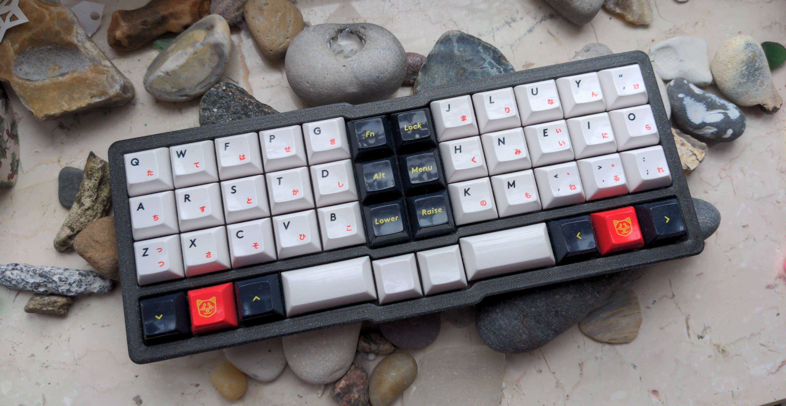
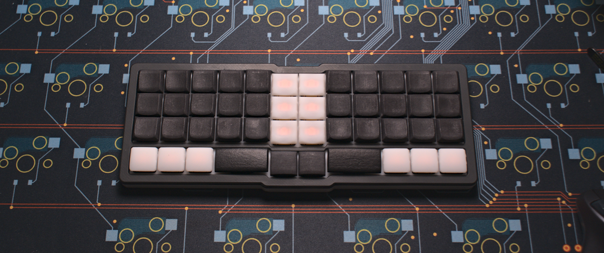

### Kong

48 key orthogonal keyboard with offset bottom row

## Features

- seperate pcbs/cases for choc v1 and mx switches.
- Hotswap sockets
- onboard rp2040
- production files for pcba
- case files are supplied (stl, dxf, as well as the freecad files)
- QMK with vial support
- completely open source, permissive license ([CERN-OHL-P](https://cern-ohl.web.cern.ch/home))
- bottom rows supported: 
  - 6x1u (MX)
  - 3x1u - 2u (MX and Choc)
  - 2x1u - 3u (MX)

## Want one?

All production files you need to build your own board can be found here: [choc](./prod/choc) / [mx](./prod/mx).

There are also production files with both pcbs combined to save on the assembly costs: [combined](./prod/combined)

The case is split in two parts connected by cylindrical 3mm diameter magnets. Two length are needed, 1.7mm and 3mm. The 3x3mm Magnets go into the shallow holes, so they poke out of the case. The 3x1.7mm magnets are pressed into the deeper holes. The longer magnet acting as a pin increasing stability and keeping the top part in place. 

The bottom case is open by design and ends at a bit under the hotswap sockets. It's meant to be used with self adhesive neopren sheets (2-3mm thick), which are cut to be the same size as the pcb and then glued on top of the underside of the pcb.

Parts needed beside the assembled pcbs:

- 38 hotswap sockets ( mx or choc)

- 38 of your favourite switches (mx or choc)

- 1x 1.6mm mid-mount 16-pin USB-C connector for the choc board. I've omitted this from assembly to avoid needing the higher tier assembly. Those connectors can easily be found on Aliexpress, Mouse, Digikey etc. and are quite easy to handsolder

### firmware
firmware configs for qmk and vial can be found in the respective firmware folders: [choc](./firmware/kong) / [mx](./firmware/kongmx).

The first time the pcb is plugged in, the bootloader will provide a drive to upload the firmware file. 
You may either build the firmware yourself or use the provided vial firmware files [here](./firmware/uf2). You can use VIAL ([download](https://get.vial.today/) to program your board after that, without need to build a new firmware.

### the rest

Everything in this repository is free to use however you might see fit. If you want to support me and my projects, please consider linking back to this repository if you build/change/use anything.

If you would like to send me a tip, you could do it [here](https://ko-fi.com/weteor) (Please don't feel like you have to).

### more pictures

